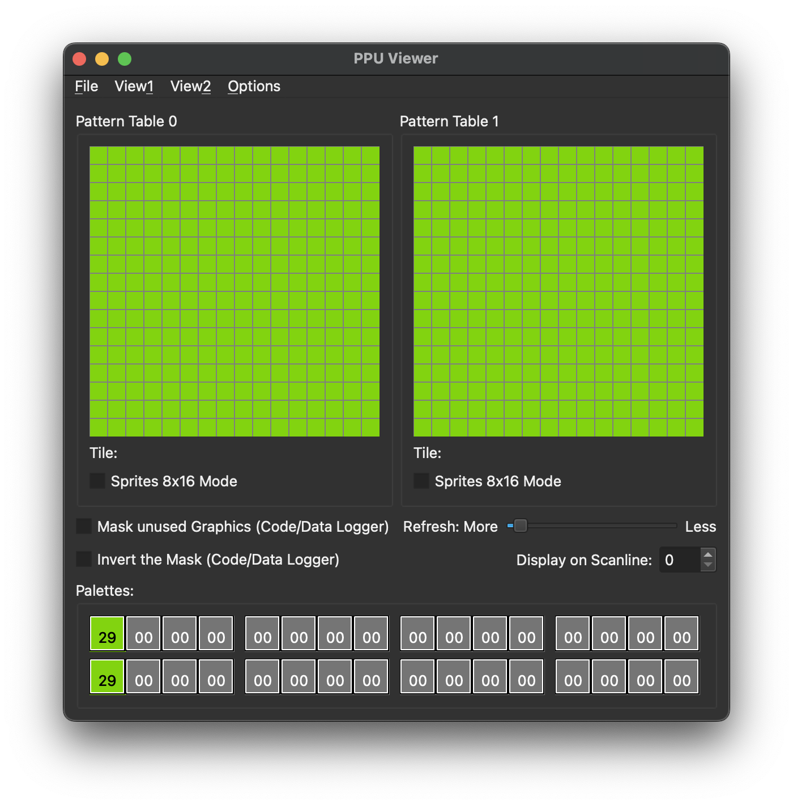

# nes-hello-world
Hello world examples in [NES 6502 assembler](https://www.masswerk.at/6502/6502_instruction_set.html#PHP) for [ca65/ld65](https://cc65.github.io/doc/)

The [NES (Nintendo Entertainment System)](https://en.wikipedia.org/wiki/Nintendo_Entertainment_System), known as famicom in Japan, cannot handle text.
Instead, it is made to handle graphics.

Because showing the text "hello, world!" requires complex handling of grapchis, a different approach is usually used as "NES hello world".

1. [hello-background-color.nes](#hello-background-colornes)
2. [hello-background-tiles.nes](#hello-background-tilesnes)
3. [hello-world.nes](#hello-worldnes)
4. [Special thanks to](#special-thanks-to)

## hello-background-color.nes
The most common approach is to just change the background color of the screen.

For that, the background color is set to index 0x29 and tiles (pattern tables) are filled with index 0.

- See the source code [hello-background-color.asm](hello-background-color/src/hello-background-color.asm)

## hello-background-tiles.nes
The next step is to place background tiles on the screen.

- Background color: black (0x0F)
- Palette 0, color 1: white (0x30)
- Pattern table 0
  - tile 0: filled with zeroes
  - tile 1: filled with ones
  - rest tiles: filled with zeroes

- See the source code [hello-background-tiles](hello-background-tiles/src/hello-background-tiles.asm)

## hello-world.nes
Finally, we are ready to create background tiles that represent letters and use them to display "hello, world!"

But, this time, instead of hardcoding binary data, we can use the [NEXXT](https://frankengraphics.itch.io/nexxt) tile editor to create the [background pattern table](hello-world/res/).

The characters are placed in the pattern table in such a way that their pattern table index coincides with their ASCII index.

Notice that to have available all characters of the ASCII table, almost half of the pattern table is full. That is why many NES games show little characters to allow more space for graphics.

- See the source code [hello-world](hello-world/src/hello-world.asm)

# Special thanks to
- https://www.youtube.com/@NesHacker
- https://www.youtube.com/@DisplacedGamers
- https://famicom.party
- https://www.nesdev.org/wiki/Nesdev_Wiki
  - https://discord.gg/JSG4kuF8EK (including people in the discord channel)
